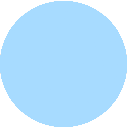
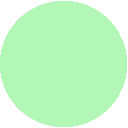
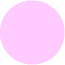

# Neovim default colorscheme extras

This repository contains extras of the new default colorscheme [introduced in Neovim 0.10](https://gpanders.com/blog/whats-new-in-neovim-0.10/#defaults).

The palette below is extracted from the [neovim source code](https://github.com/neovim/neovim/blob/41fb98d6fab5aa02ef370d1b2b283b078517ffa4/src/nvim/highlight_group.c#L2888):

<table>
	<tr>
		<th></th>
		<th>Labels</th>
		<th>Hex</th>
		<th>rgb_decimal</th>
		<th>rgb_hexadecimal</th>
	</tr>
	<tr>
		<td></td>
		<td>NvimDarkBlue</td>
		<td><code>#004c63</code></td>
		<td><code>rgb(0,76,115)</code></td>
		<td><code>RGB_(0x00, 0x4c, 0x73)</code></td>
	</tr>
	<tr>
		<td></td>
		<td>NvimDarkCyan</td>
		<td><code>#007373</code></td>
		<td><code>rgb(0,115,115)</code></td>
		<td><code>RGB_(0x00,0x73,0x73)</code></td>
	</tr>
	<tr>
		<td></td>
		<td>NvimDarkGreen</td>
		<td><code>#005523</code></td>
		<td><code>rgb(0,85,35)</code></td>
		<td><code>RGB_(0x00,0x55,0x23)</code></td>
	</tr>
	<tr>
		<td></td>
		<td>NvimDarkMagenta</td>
		<td><code>#470045</code></td>
		<td><code>rgb(71,0,69)</code></td>
		<td><code>RGB_(0x47,0x00,0x45)</code></td>
	</tr>
	<tr>
		<td></td>
		<td>NvimDarkRed</td>
		<td><code>#590008</code></td>
		<td><code>rgb(89,0,8)</code></td>
		<td><code>RGB_(0x59,0x00,0x08)</code></td>
	</tr>
	<tr>
		<td></td>
		<td>NvimDarkYellow</td>
		<td><code>#6b5300</code></td>
		<td><code>rgb(107,83,0)</code></td>
		<td><code>RGB_(0x6b,0x53,0x00)</code></td>
	</tr>
	<tr>
		<td></td>
		<td>NvimLightBlue</td>
		<td><code>#A6DBFF</code></td>
		<td><code>rgb(166,219,255)</code></td>
		<td><code>RGB_(0xa6,0xdb,0xff)</code></td>
	</tr>
	<tr>
		<td></td>
		<td>NvimLightCyan</td>
		<td><code>#8cf8f7</code></td>
		<td><code>rgb(140,248,247)</code></td>
		<td><code>RGB_(0x8c,0xf8,0xf7)</code></td>
	</tr>
	<tr>
		<td></td>
		<td>NvimLightGreen</td>
		<td><code>#b4f6c0</code></td>
		<td><code>rgb(179, 246, 192)</code></td>
		<td><code>RGB_(0xb3, 0xf6, 0xc0)</code></td>
	</tr>
	<tr>
		<td></td>
		<td>NvimLightMagenta</td>
		<td><code>#FFCAFF</code></td>
		<td><code>rgb(255, 202, 255)</code></td>
		<td><code>RGB_(0xff, 0xca, 0xff)</code></td>
	</tr>
	<tr>
		<td></td>
		<td>NvimLightRed</td>
		<td><code>#FFC0B9</code></td>
		<td><code>rgb(255, 192, 185)</code></td>
		<td><code>RGB_(0xff, 0xc0, 0xb9)</code></td>
	</tr>
	<tr>
		<td></td>
		<td>NvimLightYellow</td>
		<td><code>#FCE094</code></td>
		<td><code>rgb(252, 224, 148)</code></td>
		<td><code>RGB_(0xfc, 0xe0, 0x94)</code></td>
	</tr>
	<tr>
		<td></td>
		<td>NvimDarkGrey1</td>
		<td><code>#07080D</code></td>
		<td><code>rgb(7,8,13)</code></td>
		<td><code>RGB_(0x07,0x08,0x0d)</code></td>
	</tr>
	<tr>
		<td></td>
		<td>NvimDarkGrey2</td>
		<td><code>#14161B</code></td>
		<td><code>rgb(20,22,27)</code></td>
		<td><code>RGB_(0x2c,0x2e,0x33)</code></td>
	</tr>
	<tr>
		<td></td>
		<td>NvimDarkGrey3</td>
		<td><code>#2c2e33</code></td>
		<td><code>rgb(44,46,51)</code></td>
		<td><code>RGB_(0x2c,0x2e,0x33)</code></td>
	</tr>
	<tr>
		<td></td>
		<td>NvimDarkGrey4</td>
		<td><code>#4f5258</code></td>
		<td><code>rgb(79,82,88)</code></td>
		<td><code>RGB_(0x4f,0x52,0x58)</code></td>
	</tr>
	<tr>
		<td></td>
		<td>NvimLightGrey1</td>
		<td><code>#EEF1F8</code></td>
		<td><code>rgb(238,241,248)</code></td>
		<td><code>RGB_(0xee, 0xf1, 0xf8)</code></td>
	</tr>
	<tr>
		<td></td>
		<td>NvimLightGrey2</td>
		<td><code>#E0E2EA</code></td>
		<td><code>rgb(224, 226, 234)</code></td>
		<td><code>RGB_(0xe0, 0xe2, 0xea)</code></td>
	</tr>
	<tr>
		<td></td>
		<td>NvimLightGrey3</td>
		<td><code>#C4C6CD</code></td>
		<td><code>rgb(196, 198, 205)</code></td>
		<td><code>RGB_(0xc4, 0xc6, 0xcd)</code></td>
	</tr>
	<tr>
		<td></td>
		<td>NvimLightGrey4</td>
		<td><code>#9b9ea4</code></td>
		<td><code>rgb(155, 158, 164)</code></td>
		<td><code>RGB_(0x9b, 0x9e, 0xa4)</code></td>
	</tr>
</table>

# Contribute

Feel free to make a PR and add your own ports

# Acknowledgements

- Huge thanks to [Evgeni Chasnovski](https://github.com/echasnovski) for creating the theme.
